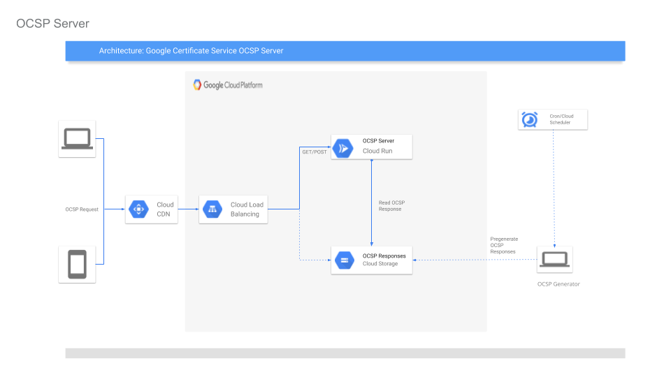

## OCSP Server for Google Cloud Certificate Service

[Online Certificate Status Protocol (OCSP)](https://en.wikipedia.org/wiki/Online_Certificate_Status_Protocol) Server for Google Cloud [Certificate Authority Service](https://cloud.google.com/certificate-authority-service/docs).

> This is not an officially supported Google product

### Architecture

OCSP responses are pre-generated in batch offline and saved as static files on GCS where the *filename* itself _is_ the base64 encoded form of an actual OCSP Request (`filename=b64encode(ocspRequest) filecontent=ocspResponse`).


* OCSP requests are handled by a [Cloud Run](https://cloud.google.com/run/docs) instance through a Google Cloud Load Balancer.  The Run instance proxies the OCSP response from GCS which is also locally cached within the instance instance as well as though [Cloud CDN](https://cloud.google.com/cdn/docs)

    `client --> CDN --> L7LB --> Cloud Run --> GCS`



Since the files in GCS are are the encoded form of an OCSP Request, GCS alone can be used to serve `GET` requests.  There is no real point for that in the current architecture since Cloud CDN will cache data directly but this option is described anyway in the Appendix.

#### Components

* `genocsp/genocsp.go` OCSP Response Generator:  used to iterate over Certificates and generate OCSP Responses on GCS.
* `server.go` OCSP application server deployable on Cloud Run or GKE or Container Optimized VMs.

### Prerequisite

First setup environment variables

```bash
export PROJECT_ID=`gcloud config get-value core/project`
export PROJECT_NUMBER=`gcloud projects describe $PROJECT_ID --format="value(projectNumber)"`
export REGION=us-central1
```

It is assumed you already have a RootCA configured. In the example below, the CA to use is called `prod-root`.

The server component will serve an OCSP response from GCS after validating the inbound request to the server is an OCSP Request itself.  Though not implemented currently, the server could validate the Request is the CA it handles requests for.

```bash
export CA_NAME=prod-root

$ gcloud alpha privateca roots list
NAME       LOCATION     STATE    NOT_BEFORE         NOT_AFTER
prod-root  us-central1  ENABLED  2020-04-22T00:18Z  2030-04-22T10:26Z
```

### OCSP Generator

The system that is pre-generating the OCSP responses must have credentials that allow Read Access to Private CA (`roles/privateca.auditor`).

It must also have access to write to the GCS Bucket where OCSP responses are Stored.

#### Configure OCSP Response Bucket

```bash
export OCSP_GENERATOR_SERVICE_ACCOUNT=ocsp-gen@$PROJECT_ID.iam.gserviceaccount.com
export OCSP_BUCKET=$PROJECT_ID-ocsp
gsutil mb gs://$OCSP_BUCKET

mkdir certs/
gcloud iam service-accounts create ocsp-gen --display-name="OCSP Generator Service Account" --project $PROJECT_ID
gcloud iam service-accounts keys  create certs/ocsp-gen.json --iam-account=$OCSP_GENERATOR_SERVICE_ACCOUNT --project $PROJECT_ID

gsutil iam ch serviceAccount:$OCSP_GENERATOR_SERVICE_ACCOUNT:objectAdmin gs://$OCSP_BUCKET
```

Then allow the service account access to audit certificates from your CA.

Now add an IAM policy that will allow the OCSP generator to list certificates. Create a [Custom IAM role](https://cloud.google.com/iam/docs/creating-custom-roles) with permissions that include just `privateca.certificates.list` and `privateca.certificates.get` and use that in the command below.

Create a `ocsp-role-definition.yaml` file below (remember to replace `$PROJECT_ID`)

- `ocsp-role-definition.yaml`
```yaml
includedPermissions:
- privateca.certificates.list
- privateca.certificates.get
name: projects/$PROJECT_ID/roles/OCSPGeneratorRole
stage: GA
title: OCSP Generator
```

Create the Custom Role

```bash
gcloud iam roles create ocspResponderRole --project=$PROJECT_ID \
  --file=ocsp-custom-role.yaml
```

Then apply the custom role

```bash
gcloud alpha privateca roots add-iam-policy-binding $CA_NAME \
  --location $REGION \
  --member "serviceAccount:$OCSP_GENERATOR_SERVICE_ACCOUNT" --role "projects/$PROJECT_ID/roles/OCSPGeneratorRole"
```

Alternatively, instead of a custom role, you can assign the pre-defined  `roles/privateca.auditor` role though that has additional read-only permissions that allow get/list IAM policies

```bash
gcloud alpha privateca roots add-iam-policy-binding $CA_NAME \
  --location $REGION \
  --member "serviceAccount:$OCSP_GENERATOR_SERVICE_ACCOUNT" --role "roles/privateca.auditor"
```

#### Acquire the RootCA Certificate

```bash
gcloud alpha privateca roots describe \
  $CA_NAME \
  --location $REGION \
  --project $PROJECT_ID \
  --format="value(pemCert)" > rootca.crt
```

#### Generate the KeyPair that allows for OCSP Signing

```bash
gcloud alpha privateca certificates create --issuer $CA_NAME \
  --issuer-location $REGION  --generate-key  --key-output-file ocsp_signer_key.pem  \
  --cert-output-file ocsp_signer_crt.pem --subject "CN=ocsp_signer"  \
  --extended-key-usages="ocsp_signing"
```

>> Be *very careful* with the certificate: this is what signs the OCSP Responses

#### Run OCSP Generator

The following command will generate OCSP responses for all certificates managed by `$CA_NAME`:

```bash
export GOOGLE_APPLICATION_CREDENTIALS=certs/ocsp-gen.json

go run genocsp/genocsp.go \
  --projectID=$PROJECT_ID \
  --location=$REGION \
  --ca_name=$CA_NAME \
  --ocsp_signer_key=ocsp_signer_key.pem \
  --ocsp_signer_crt=ocsp_signer_crt.pem \
  --bucketName=$OCSP_BUCKET \
  --expiry=3600s
```

To generate an update for a single certificate, specify the hex serial number as an argument

```bash
--serial_number=aa0e925db36690ed30cce924da5dae297a06d401
```

| Option | Description |
|:------------|-------------|
| **`--projectID`** | GCP ProjectID for CA Service |
| **`--location`** | CA Service Location |
| **`--ca_name`** | CA Name  |
| **`--ocsp_signer_key`** | OCSP Signer Key or path to GCP Secrets |
| **`--ocsp_signer_crt`** | OCSP Signer Certificate or path to GCP Secrets|
| **`--bucketName`** | GCS Bucket for OCSP Responses  |
| **`--expiry`** | Duration (as proto `Duration`) the OCSP Response is valid for  (`nextUpdate`) |
| **`--serial_number`** | SerialNumber for a certificate to generate a Response for |
| **`--useSecrets`** | use Cloud Secrets for OCSP keypair |
| **`--http_port`** | enable OCSP Generator as HTTP server |


The optional `--http_port=` parameter will start an HTTP server instead of immediately generating a certificate. The intent of running in the HTTP-server mode is described in the section `Serverless OCSP Generator` below.


#### Verify OCSP Responses are created

```
gsutil ls gs://$OCSP_BUCKET
```

>> **NOTE** The files listed under the bucket are actual base64 encoded OCSP _Responses_ where the file name is the base64 encoded OCSP _Request_

### OCSP Server

Generate and deploy an OCSP Server on Cloud Run. 

This OCSP server will basically just proxy read an object from GCS.  Since the OCSP Generator saved objects as the encoded 
OCSP Response, Cloud Run has to "just read" a file that is provided in the OCSP POST request.

OCSP Server will LRU cache default `2000` OCSP Responses it processes but will check each OCSP Response's `NextUpdate` value before returning it.  

If the OCSP response is stale, it is evicted from instance-local cache and reread from GCS and will log that the specific certificate SerialNumber's response is stale.

If the OCSP Generator is run at anytime, the stale Responses will get refreshed from GCS by each cloud run instance the next time a request arrives for that serialNumber.

Cloud Run is designed to run for a maximum 15 minutes so the cache here will live as long as the instance.  
TODO: use Cloud Redis as a cache instead of instance-local.

Do NOT save any other files in `$OCSP_BUCKET` since Cloud Run will read a valid OCSP Request and will try to read a base64 encoded format of its filename.

#### Create a Service Account for Cloud Run and allow it to read OCSP responses

```bash
gcloud iam service-accounts create ocsp-svc --display-name="OCSP Server Service Account" --project $PROJECT_ID

export OCSP_SERVER_SERVICE_ACCOUNT=ocsp-svc@$PROJECT_ID.iam.gserviceaccount.com

gsutil iam ch serviceAccount:$OCSP_SERVER_SERVICE_ACCOUNT:objectViewer gs://$OCSP_BUCKET
```

#### Run OCSP Server

```bash
echo $OCSP_BUCKET
go run server.go \
  --http_port=:8080
```

| Option | Description |
|:------------|-------------|
| **`--httpPort`** | Listener host:port |
| **`--ocsp_bucket`** | GCS Bucket where OCSP Responses are saved  |
| **`--cache_size`** | Size of the instance local LRU Cache |
| **`--issuer`** | (optional) Issuer CA certificate to use to cross check the OCSP Response is issued by the CA |

Test the OCSP signer with any cert issued by the CA. 
In this case, use `ocsp_signer_crt.pem`:

```bash
openssl ocsp \
  -CA rootca.crt \
  -CAfile rootca.crt \
  -issuer rootca.crt \
  -cert ocsp_signer_crt.pem \
  -url http://localhost:8080 -resp_text -no_nonce
```

#### Build and push OCSP server

```bash
docker build -t gcr.io/$PROJECT_ID/ocsp  .
docker push gcr.io/$PROJECT_ID/ocsp
```

#### Deploy Server to Cloud Run

```bash
gcloud beta run deploy ocsp \
 --image gcr.io/$PROJECT_ID/ocsp \
 --set-env-vars OCSP_BUCKET=$OCSP_BUCKET \
 --allow-unauthenticated \
 --region $REGION \
 --platform=managed \
 --service-account $OCSP_SERVER_SERVICE_ACCOUNT \
 --args="--http_port=:8080"
```

The Run service will be deployed to an HTTPS endpoint

(Your run endpoint will be different)

```bash
Service [ocsp] revision [ocsp-00002-yex] has been deployed and is serving 100 percent of traffic at https://ocsp-6w42z6vi3q-uc.a.run.app
```

#### (optional) Verify OCSP Endpoint

* `POST`

openssl uses `POST`

```bash
openssl ocsp \
  -CA rootca.crt \
  -CAfile rootca.crt \
  -issuer rootca.crt \
  -cert ocsp_signer_crt.pem \
  -url https://ocsp-6w42z6vi3q-uc.a.run.app \
  -resp_text -no_nonce
```

* `GET`

First generate an encoded OCSP Request object

```bash
openssl ocsp -CA rootca.crt \
  -CAfile rootca.crt \
  -issuer rootca.crt \
  -cert ocsp_signer_crt.pem \
  -resp_text -no_nonce  \
  -reqout /tmp/req.req -out /dev/null

export OCSP_FILENAME=`openssl enc -in /tmp/req.req | base64 -w 0  -`
echo $OCSP_FILENAME
export OCSP_URL_ENCODED=`jq -R -r @uri <<<"$OCSP_FILENAME"`
echo $OCSP_URL_ENCODED
curl -s "https://ocsp-6w42z6vi3q-uc.a.run.app/$OCSP_URL_ENCODED" | \
  openssl ocsp -CA rootca.crt -CAfile rootca.crt   -resp_text -no_nonce -text -respin -
```

### Create HTTP L7 Loadbalancer

#### Allocate External IP

```bash
gcloud compute addresses create ocsp-server --global --project $PROJECT_ID

$ gcloud compute addresses list ocsp-server --global --project $PROJECT_ID

NAME         ADDRESS/RANGE   TYPE      PURPOSE  NETWORK  REGION  SUBNET  STATUS
ocsp-server  35.244.204.124  EXTERNAL                                    RESERVED

export ADDRESS=`gcloud compute addresses describe ocsp-server --format="value(address)" --global`
echo $ADDRESS
```

>> Ofcourse do NOT store any other data in this bucket!


#### Create Cloud Run Backend NEG 

Configure [Serverless NEG](https://cloud.google.com/load-balancing/docs/negs/setting-up-serverless-negs) backend

```bash
gcloud beta compute network-endpoint-groups create ocsp-serverless-neg \
    --region=$REGION \
    --network-endpoint-type=SERVERLESS  \
    --cloud-run-service=ocsp --project $PROJECT_ID

gcloud compute backend-services create ocsp-backend-service \
    --global --enable-cdn --enable-logging --logging-sample-rate=1.0 --project $PROJECT_ID

gcloud beta compute backend-services add-backend ocsp-backend-service \
    --global \
    --network-endpoint-group=ocsp-serverless-neg \
    --network-endpoint-group-region=$REGION --project $PROJECT_ID
```

`--logging-sample-rate=1.0` enabled logging of all requests

#### Create URL Maps for OCSP Service

```bash
gcloud compute url-maps create ocsp-url-map \
    --default-service ocsp-backend-service --project $PROJECT_ID
```

#### Edit URL Map and specify path/rule for the backendService

Edit the URLMap directly and the path matches. 

The configuration should look like the following:

```bash
$ gcloud compute url-maps describe ocsp-url-map --project $PROJECT_ID
```

relevant sections:

```yaml
defaultService: https://www.googleapis.com/compute/v1/projects/$PROJECT_ID/global/backendServices/ocsp-backend-service
hostRules:
- hosts:
  - '*'
  pathMatcher: ocsp
kind: compute#urlMap
name: ocsp-url-map
pathMatchers:
- defaultService: https://www.googleapis.com/compute/v1/projects/$PROJECT_ID/global/backendServices/ocsp-backend-service
  name: ocsp
selfLink: https://www.googleapis.com/compute/v1/projects/$PROJECT_ID/global/urlMaps/ocsp-url-map
```

#### Create Target Proxy and Frontend

```bash
gcloud compute target-http-proxies create ocsp-http-proxy \
    --url-map=ocsp-url-map --project $PROJECT_ID

gcloud compute forwarding-rules create ocsp-content-rule \
    --address=$ADDRESS \
    --target-http-proxy=ocsp-http-proxy \
    --global \
    --ports=80 --project $PROJECT_ID
```

#### Verify OCSP with L7LB

- GET (GCS Backend)

```bash
curl -s "http://$ADDRESS/$OCSP_URL_ENCODED" | \
  openssl ocsp -text -CA rootca.crt -CAfile rootca.crt -issuer rootca.crt -respin -
```

Verify CDN Cache

```bash
$ curl -v "http://$ADDRESS/$OCSP_URL_ENCODED" 

> GET /MFUwUzBRME8wTTAJBgUrDgMCGgUABBSNlIvrQY0iOzRfGAJLxtxYePePpQQUXsP4cLbehnqQ%2BAV6cK0VQcg614ECFG0m%2FYrUZxVt%2B5dpAmihM6gzFI0w HTTP/1.1
> User-Agent: curl/7.68.0
> Accept: */*

< HTTP/1.1 200 OK
< Expires: Sat, 18 Jul 2020 23:41:29 GMT
< content-type: application/ocsp-response
< Date: Sat, 18 Jul 2020 22:42:02 GMT
< Server: Google Frontend
< Content-Length: 1396
< Via: 1.1 google
< Cache-Control: public
< Age: 51
```

Note the `Age` header value returned from CDN

- POST (Cloud Run Backend)

POST requests will go directly to the Cloud Run instance.  If that request is within the LRU cache for the instance and if the `NextUpdate` value is in the future, the response will be read through instance-local cache.
```bash
openssl ocsp \
  -CA rootca.crt \
  -CAfile rootca.crt \
  -issuer rootca.crt \
  -cert ocsp_signer_crt.pem \
  -url http://$ADDRESS \
  -resp_text -no_nonce
```

(note `/tmp/req.req` is the encoded OCSP request we used earlier)


### Notes

#### Invalidate CDN Cache

You can invalidate the CDN Cache by running

```bash
gcloud compute url-maps invalidate-cdn-cache ocsp-url-map --path=/*
```

#### OCSP Server with TLS

If you want to run the OCSP server with TLS on another platform, acquire a verifiable server certificate key pair from any other Public CA service.

Once the certificate is generated, create a [TLS configuration](https://cloud.google.com/load-balancing/docs/https#ssl_certificates) for the L7 Loadbalancer, enable https and point towards the same Cloud Run Backend.

You will also need to supply the OCSP Server with GCP credentials capable of reading the GCS Bucket.

#### Nginx cert stapling

To enable nginx OCSP stapling, issue a set of TLS certs for nginx (`myserver_crt.pem`, `myserver_key.pem`) and configure the server to use the OCSP Server:

- `nginx.conf`
```
    server_name         myserver.yourserver.com;
    ssl_certificate     myserver_crt.pem;
    ssl_certificate_key myserver_key.pem;

    ssl_stapling on;
    ssl_stapling_responder http://$ADDRESS;
    ssl_stapling_verify on;
    ssl_trusted_certificate rootca.pem;
    resolver 8.8.8.8;
```

#### Using GCP Secrets for OCSP Generator

The OCSP cli uses the raw RSA keys for OCSP to sign Responses.

Instead of locally saving the PEM files, you can upload the keys to [Google Secret Manager](https://cloud.google.com/secret-manager) and reference the path to the keys.  Once enabled, the OCSP server will download the keys into memory.

First upload the keys and specify IAM policies:

```bash
gcloud beta secrets create rsa-ocsp_crt \
  --replication-policy=automatic \
  --data-file=ocsp_signer_crt.pem --project $PROJECT_ID -q

gcloud beta secrets create rsa-ocsp_key \
  --replication-policy=automatic \
  --data-file=ocsp_signer_key.pem --project $PROJECT_ID -q

gcloud beta secrets add-iam-policy-binding rsa-ocsp_crt \
  --member=serviceAccount:$OCSP_GENERATOR_SERVICE_ACCOUNT \
  --role=roles/secretmanager.secretAccessor  \
  --project $PROJECT_ID -q

gcloud beta secrets add-iam-policy-binding rsa-ocsp_key \
  --member=serviceAccount:$OCSP_GENERATOR_SERVICE_ACCOUNT \
  --role=roles/secretmanager.secretAccessor  \
  --project $PROJECT_ID -q
```

Then specify `--useSecrets` and the secretName `--ocsp_signer_key=rsa-ocsp_key`, `--ocsp_signer_crt=rsa-ocsp_crt`

```bash
go run genocsp/genocsp.go \
  --projectID=$PROJECT_ID \
  --location=$REGION \
  --ca_name=$CA_NAME \
  --useSecrets \
  --ocsp_signer_key=rsa-ocsp_key \
  --ocsp_signer_crt=rsa-ocsp_crt \
  --bucketName=$OCSP_BUCKET \
  --expire_in_seconds=3600
```

At the moment, the secretManager, GCS bucket and CA all need to be in the same project.  Its relatively straightforward to separate them into different projects.


#### Serverless OCSP Generator

The OCSP generator in this repo is a CLI you run periodically.  You can also wrap the application as an HTTP server and deploy on Cloud Run

You can enable the http listener mode  by specifying the `--http_port=:8080` parameter.

```bash
$ go run genocsp/genocsp.go \
  --projectID=$PROJECT_ID \
  --location=$REGION \
  --ca_name=$CA_NAME \
  --useSecrets \
  --ocsp_signer_key=rsa-ocsp_key \
  --ocsp_signer_crt=rsa-ocsp_crt \
  --bucketName=$OCSP_BUCKET \
  --expiry=3600s \
  --http_port=8080

2020/07/19 18:24:05 Starting HTTP server
2020/07/19 18:24:06 Lookup for SerialNumber  aa697812efa2db017e6490c1080d25ab3ac1018f
2020/07/19 18:24:07 Uploading OCSP Response for serialNumber [aa697812efa2db017e6490c1080d25ab3ac1018f]

$ curl -v http://localhost:8080?serialNumber=aa697812efa2db017e6490c1080d25ab3ac1018f

> GET /?serialNumber=aa697812efa2db017e6490c1080d25ab3ac1018f HTTP/1.1
> Host: localhost:8080
> User-Agent: curl/7.68.0
> Accept: */*
> 
* Mark bundle as not supporting multiuse
< HTTP/1.1 200 OK
< Content-Type: text/plain
< Date: Sun, 19 Jul 2020 22:24:09 GMT
< Content-Length: 2
< 

ok
```

If you do not specify the `serialNumber=` parameter, the OCSP generator will iterate over all certificates.

The intent of the `OCSP Generator` as an HTTP server is to allow the `OCSP Server` to directly invoke an endpoint that triggers an update for a given certificate.

Suppose the OCSP Server reads a response from GCS that is stale/expired, the OCSP server can invoke an HTTP `GET  /?serialNumber=aa697812efa2db017e6490c1080d25ab3ac1018f` to trigger a regeneration of that OCSP Response.  The next request to the OCSP Server for that serial number will be current.

You can use [Cloud Scheduler](https://cloud.google.com/scheduler/docs/quickstart) to trigger a regeneration of the OCSP responses through another instance of Cloud Run for a full "Serverless" experience.
For more information, see [Automatic OIDC: Using Cloud Scheduler, Tasks, and PubSub to make authenticated calls to Cloud Run, Cloud Functions or your Server](https://github.com/salrashid123/automatic_gcp_oidc).  If you do deploy to Cloud Run, please use `--useSecrets` and enable Cloud Run to only allow authenticated calls from Scheduler.

To build the OCSPGenerator as a container, use `Dockerfile.genocsp` as the target for the build.

#### Serving GET requests directly from GCS

You can also directly read an OCSP Response from GCS since the filename is the base64 encoded request itself.  You may want to use "direct serving from GCS" and not have to  enable Cloud CDN, Cloud Run, etc if the requests for OCSP are GET request only over HTTP.  

For example, in the sample below, OCSP `GET` requests are served directly from GCS though a Google Cloud Load Balancer

  `client --> L7LB --> GCS`

- Create Backend Bucket

```bash
gcloud compute backend-buckets \
  create ocsp-backend-bucket --gcs-bucket-name=$OCSP_BUCKET \
  --description="Backend Bucket for OCSP Responses" --enable-cdn \
  --project $PROJECT_ID

$ gcloud compute backend-buckets list --project $PROJECT_ID
NAME                 GCS_BUCKET_NAME           ENABLE_CDN
ocsp-backend-bucket  $PROJECT_ID-ocsp          True  
```

Note, the command above enables [Cloud CDN](https://cloud.google.com/cdn/docs/setting-up-cdn-with-bucket#gcloud-or-gsutil) for those requests served from GCS but the cache-header and Expiry will not reflect the value of the OCSP response's `NextUpdate` value.

- Make BackendBucket PublicRead
```bash
gsutil iam ch -d allUsers:objectViewer gs://$OCSP_BUCKET
```

Configure urlMap to send GET requests to GCS and POST to Cloud Run

```yaml
defaultService: https://www.googleapis.com/compute/v1/projects/$PROJECT_ID/global/backendServices/ocsp-backend-service
hostRules:
- hosts:
  - '*'
  pathMatcher: ocsp
name: ocsp-url-map
pathMatchers:
- defaultService: https://www.googleapis.com/compute/v1/projects/$PROJECT_ID/global/backendServices/ocsp-backend-bucket
  name: ocsp
  pathRules:
  - paths:
    - /
    service: https://www.googleapis.com/compute/v1/projects/$PROJECT_ID/global/backendBuckets/ocsp-backend-service
```

At this point `GET` requests should go to GCS while `POST` to Cloud Run.

As mentioned, you can bypass CDN as well and make an http request directly for an object in GCS.

#### References

- https://tools.ietf.org/html/rfc2560#appendix-A.1.1
- http://nginx.org/en/docs/http/ngx_http_ssl_module.html#ssl_stapling
- https://tools.ietf.org/html/rfc5019#page-7

